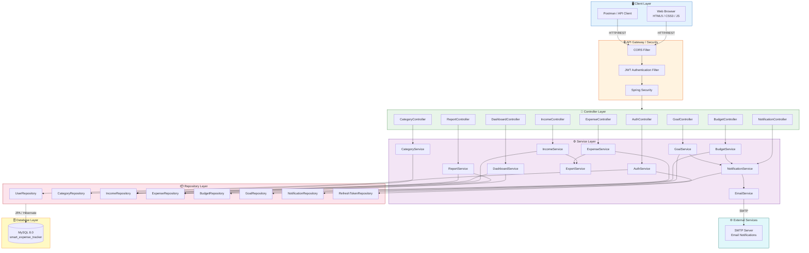
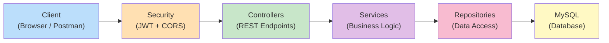
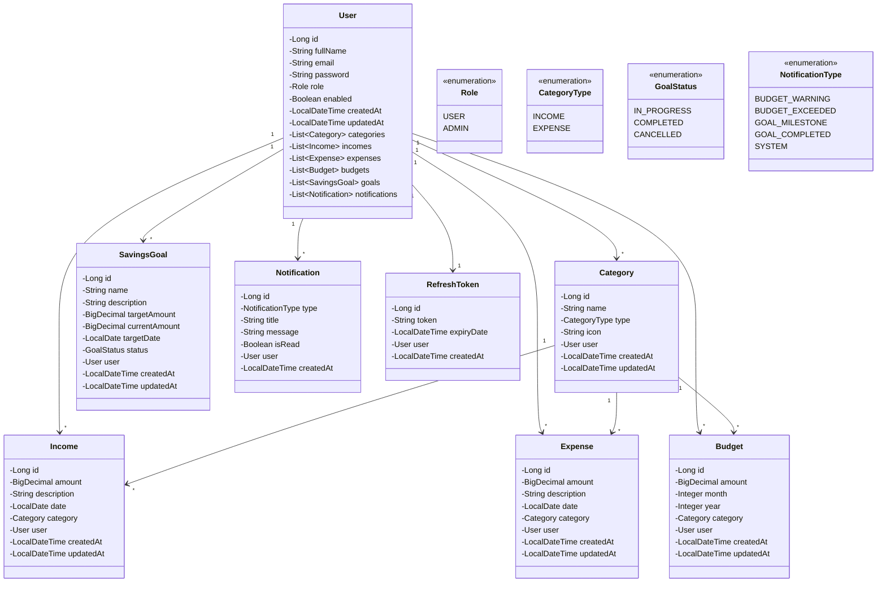
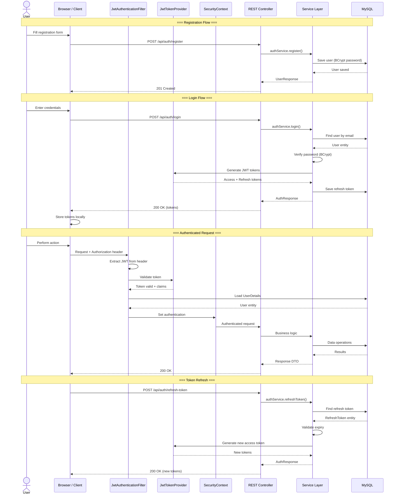
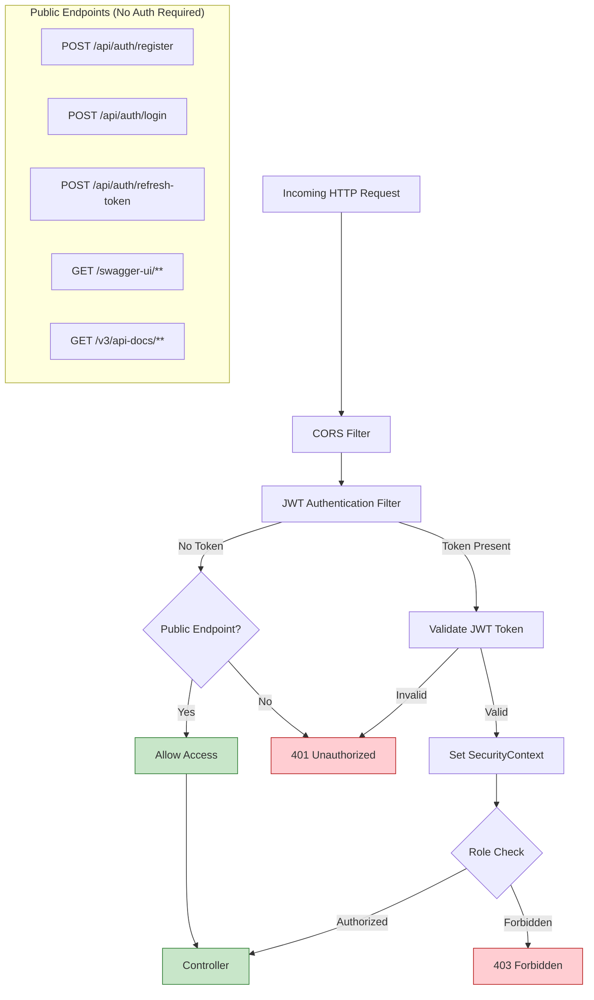
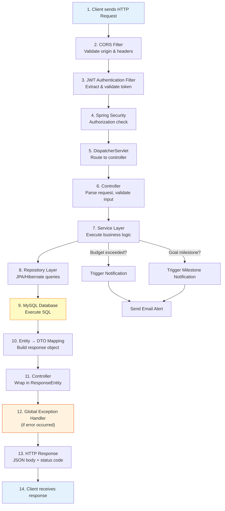
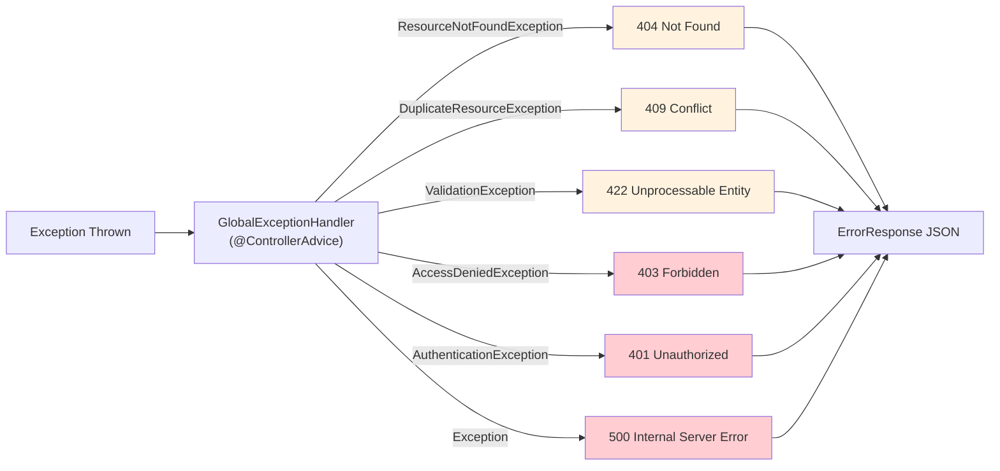

# 🏗️ Architecture Diagram — Smart Expense Tracker System

This document presents the High-Level Design (HLD), Low-Level Design (LLD), security architecture, and request lifecycle of the Smart Expense Tracker System.

---

## Table of Contents

- [High-Level Design (HLD)](#high-level-design-hld)
- [Low-Level Design (LLD)](#low-level-design-lld)
- [Security Flow](#security-flow)
- [Request Lifecycle](#request-lifecycle)

---

## High-Level Design (HLD)

### System Architecture Overview

### Layered Architecture Summary

---

## Low-Level Design (LLD)

### Controller Layer — Class Diagram

```mermaid
classDiagram
    class AuthController {
        -AuthService authService
        +register(RegisterRequest) ResponseEntity
        +login(LoginRequest) ResponseEntity
        +refreshToken(RefreshTokenRequest) ResponseEntity
    }

    class CategoryController {
        -CategoryService categoryService
        +getAllCategories() ResponseEntity
        +getCategoryById(Long id) ResponseEntity
        +createCategory(CategoryRequest) ResponseEntity
        +updateCategory(Long id, CategoryRequest) ResponseEntity
        +deleteCategory(Long id) ResponseEntity
    }

    class IncomeController {
        -IncomeService incomeService
        +getAllIncomes(Pageable) ResponseEntity
        +getIncomeById(Long id) ResponseEntity
        +createIncome(IncomeRequest) ResponseEntity
        +updateIncome(Long id, IncomeRequest) ResponseEntity
        +deleteIncome(Long id) ResponseEntity
        +exportPdf() ResponseEntity
        +exportExcel() ResponseEntity
        +exportCsv() ResponseEntity
    }

    class ExpenseController {
        -ExpenseService expenseService
        +getAllExpenses(Pageable) ResponseEntity
        +getExpenseById(Long id) ResponseEntity
        +createExpense(ExpenseRequest) ResponseEntity
        +updateExpense(Long id, ExpenseRequest) ResponseEntity
        +deleteExpense(Long id) ResponseEntity
        +searchExpenses(String keyword, Pageable) ResponseEntity
        +filterExpenses(FilterRequest) ResponseEntity
        +getByCategory(Long categoryId) ResponseEntity
        +exportPdf() ResponseEntity
        +exportExcel() ResponseEntity
        +exportCsv() ResponseEntity
    }

    class BudgetController {
        -BudgetService budgetService
        +getAllBudgets() ResponseEntity
        +getBudgetById(Long id) ResponseEntity
        +createBudget(BudgetRequest) ResponseEntity
        +updateBudget(Long id, BudgetRequest) ResponseEntity
        +deleteBudget(Long id) ResponseEntity
    }

    class GoalController {
        -GoalService goalService
        +getAllGoals() ResponseEntity
        +getGoalById(Long id) ResponseEntity
        +createGoal(GoalRequest) ResponseEntity
        +updateGoal(Long id, GoalRequest) ResponseEntity
        +deleteGoal(Long id) ResponseEntity
        +addSavings(Long id, SavingsRequest) ResponseEntity
    }

    class DashboardController {
        -DashboardService dashboardService
        +getDashboard() ResponseEntity
    }

    class ReportController {
        -ReportService reportService
        +getMonthlyReport(int month, int year) ResponseEntity
        +getYearlyReport(int year) ResponseEntity
        +getCategoryReport(LocalDate start, LocalDate end) ResponseEntity
        +getIncomeVsExpense(LocalDate start, LocalDate end, String granularity) ResponseEntity
    }

    class NotificationController {
        -NotificationService notificationService
        +getAllNotifications(Pageable) ResponseEntity
        +getUnreadCount() ResponseEntity
        +markAsRead(Long id) ResponseEntity
    }
```

### Service Layer — Class Diagram

```mermaid
classDiagram
    class AuthService {
        <<interface>>
        +register(RegisterRequest) UserResponse
        +login(LoginRequest) AuthResponse
        +refreshToken(RefreshTokenRequest) AuthResponse
    }

    class AuthServiceImpl {
        -UserRepository userRepository
        -RefreshTokenRepository tokenRepository
        -PasswordEncoder passwordEncoder
        -JwtTokenProvider jwtTokenProvider
        +register(RegisterRequest) UserResponse
        +login(LoginRequest) AuthResponse
        +refreshToken(RefreshTokenRequest) AuthResponse
    }

    class CategoryService {
        <<interface>>
        +getAll() List~CategoryResponse~
        +getById(Long) CategoryResponse
        +create(CategoryRequest) CategoryResponse
        +update(Long, CategoryRequest) CategoryResponse
        +delete(Long) void
    }

    class IncomeService {
        <<interface>>
        +getAll(Pageable) Page~IncomeResponse~
        +getById(Long) IncomeResponse
        +create(IncomeRequest) IncomeResponse
        +update(Long, IncomeRequest) IncomeResponse
        +delete(Long) void
        +exportPdf() byte[]
        +exportExcel() byte[]
        +exportCsv() byte[]
    }

    class ExpenseService {
        <<interface>>
        +getAll(Pageable) Page~ExpenseResponse~
        +getById(Long) ExpenseResponse
        +create(ExpenseRequest) ExpenseResponse
        +update(Long, ExpenseRequest) ExpenseResponse
        +delete(Long) void
        +search(String, Pageable) Page~ExpenseResponse~
        +filter(FilterRequest) Page~ExpenseResponse~
        +getByCategory(Long) List~ExpenseResponse~
        +exportPdf() byte[]
        +exportExcel() byte[]
        +exportCsv() byte[]
    }

    class BudgetService {
        <<interface>>
        +getAll() List~BudgetResponse~
        +getById(Long) BudgetResponse
        +create(BudgetRequest) BudgetResponse
        +update(Long, BudgetRequest) BudgetResponse
        +delete(Long) void
    }

    class GoalService {
        <<interface>>
        +getAll() List~GoalResponse~
        +getById(Long) GoalResponse
        +create(GoalRequest) GoalResponse
        +update(Long, GoalRequest) GoalResponse
        +delete(Long) void
        +addSavings(Long, SavingsRequest) GoalResponse
    }

    class DashboardService {
        <<interface>>
        +getDashboardData() DashboardResponse
    }

    class ReportService {
        <<interface>>
        +getMonthlyReport(int, int) MonthlyReport
        +getYearlyReport(int) YearlyReport
        +getCategoryReport(LocalDate, LocalDate) CategoryReport
        +getIncomeVsExpense(LocalDate, LocalDate, String) ComparisonReport
    }

    class NotificationService {
        <<interface>>
        +getAll(Pageable) Page~NotificationResponse~
        +getUnreadCount() Long
        +markAsRead(Long) NotificationResponse
        +createNotification(NotificationRequest) void
    }

    class ExportService {
        -generatePdf(List, String) byte[]
        -generateExcel(List, String) byte[]
        -generateCsv(List, String) byte[]
    }

    class EmailService {
        -JavaMailSender mailSender
        +sendEmail(String to, String subject, String body) void
        +sendBudgetAlert(User, Budget) void
        +sendGoalMilestone(User, SavingsGoal) void
    }

    AuthService <|.. AuthServiceImpl
    AuthServiceImpl --> ExportService : uses
    IncomeService --> ExportService : uses
    ExpenseService --> ExportService : uses
    BudgetService --> NotificationService : triggers
    GoalService --> NotificationService : triggers
    NotificationService --> EmailService : sends
```

### Entity Layer — Class Diagram

### Repository Layer — Class Diagram

```mermaid
classDiagram
    class JpaRepository~T, ID~ {
        <<interface>>
        +save(T entity) T
        +findById(ID id) Optional~T~
        +findAll() List~T~
        +deleteById(ID id) void
    }

    class UserRepository {
        <<interface>>
        +findByEmail(String email) Optional~User~
        +existsByEmail(String email) Boolean
    }

    class CategoryRepository {
        <<interface>>
        +findByUserId(Long userId) List~Category~
        +findByUserIdAndType(Long userId, CategoryType type) List~Category~
    }

    class IncomeRepository {
        <<interface>>
        +findByUserId(Long userId, Pageable pageable) Page~Income~
        +findByUserIdAndDateBetween(Long userId, LocalDate start, LocalDate end) List~Income~
        +sumAmountByUserIdAndDateBetween(Long userId, LocalDate start, LocalDate end) BigDecimal
    }

    class ExpenseRepository {
        <<interface>>
        +findByUserId(Long userId, Pageable pageable) Page~Expense~
        +findByUserIdAndDateBetween(Long userId, LocalDate start, LocalDate end) List~Expense~
        +findByUserIdAndDescriptionContaining(Long userId, String keyword, Pageable pageable) Page~Expense~
        +findByUserIdAndCategoryId(Long userId, Long categoryId) List~Expense~
        +sumAmountByUserIdAndDateBetween(Long userId, LocalDate start, LocalDate end) BigDecimal
        +sumAmountByUserIdAndCategoryIdAndMonthAndYear(Long userId, Long categoryId, int month, int year) BigDecimal
    }

    class BudgetRepository {
        <<interface>>
        +findByUserId(Long userId) List~Budget~
        +findByUserIdAndMonthAndYear(Long userId, int month, int year) List~Budget~
        +findByUserIdAndCategoryIdAndMonthAndYear(Long userId, Long categoryId, int month, int year) Optional~Budget~
    }

    class GoalRepository {
        <<interface>>
        +findByUserId(Long userId) List~SavingsGoal~
        +findByUserIdAndStatus(Long userId, GoalStatus status) List~SavingsGoal~
    }

    class NotificationRepository {
        <<interface>>
        +findByUserIdOrderByCreatedAtDesc(Long userId, Pageable pageable) Page~Notification~
        +countByUserIdAndIsReadFalse(Long userId) Long
    }

    class RefreshTokenRepository {
        <<interface>>
        +findByToken(String token) Optional~RefreshToken~
        +findByUserId(Long userId) Optional~RefreshToken~
        +deleteByUserId(Long userId) void
    }

    JpaRepository <|-- UserRepository
    JpaRepository <|-- CategoryRepository
    JpaRepository <|-- IncomeRepository
    JpaRepository <|-- ExpenseRepository
    JpaRepository <|-- BudgetRepository
    JpaRepository <|-- GoalRepository
    JpaRepository <|-- NotificationRepository
    JpaRepository <|-- RefreshTokenRepository
```

---

## Security Flow

### JWT Authentication Flow

### Security Configuration Overview

---

## Request Lifecycle

### Complete Request Processing Pipeline

### Exception Handling Flow

