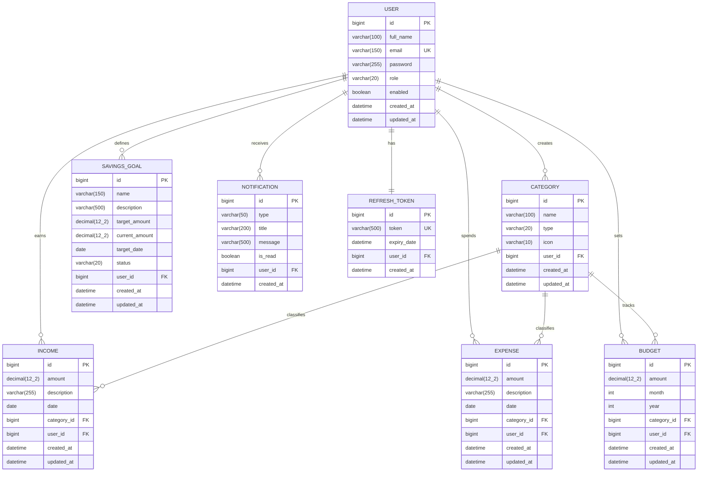

# 🗄️ Database Design — Smart Expense Tracker System

This document describes the complete database schema, entity relationships, table structures, and indexing strategy for the Smart Expense Tracker System.

---

## Table of Contents

- [ER Diagram](#er-diagram)
- [Table Descriptions](#table-descriptions)
- [Relationship Explanations](#relationship-explanations)
- [Indexes](#indexes)

---

## ER Diagram



---

## Table Descriptions

### 1. `users`

Stores registered user accounts.

| Column | Type | Constraints | Description |
|--------|------|-------------|-------------|
| `id` | BIGINT | PK, AUTO_INCREMENT | Unique user identifier |
| `full_name` | VARCHAR(100) | NOT NULL | User's display name |
| `email` | VARCHAR(150) | NOT NULL, UNIQUE | Login email address |
| `password` | VARCHAR(255) | NOT NULL | BCrypt-hashed password |
| `role` | VARCHAR(20) | NOT NULL, DEFAULT 'USER' | Role: `USER` or `ADMIN` |
| `enabled` | BOOLEAN | NOT NULL, DEFAULT TRUE | Account active status |
| `created_at` | DATETIME | NOT NULL | Record creation timestamp |
| `updated_at` | DATETIME | | Last update timestamp |

---

### 2. `categories`

Stores income and expense categories.

| Column | Type | Constraints | Description |
|--------|------|-------------|-------------|
| `id` | BIGINT | PK, AUTO_INCREMENT | Unique category identifier |
| `name` | VARCHAR(100) | NOT NULL | Category display name |
| `type` | VARCHAR(20) | NOT NULL | `INCOME` or `EXPENSE` |
| `icon` | VARCHAR(10) | | Emoji or icon code |
| `user_id` | BIGINT | FK → users(id), NULLABLE | Owner (NULL = system default) |
| `created_at` | DATETIME | NOT NULL | Record creation timestamp |
| `updated_at` | DATETIME | | Last update timestamp |

---

### 3. `incomes`

Records all income transactions.

| Column | Type | Constraints | Description |
|--------|------|-------------|-------------|
| `id` | BIGINT | PK, AUTO_INCREMENT | Unique income identifier |
| `amount` | DECIMAL(12,2) | NOT NULL | Income amount |
| `description` | VARCHAR(255) | | Free-text description |
| `date` | DATE | NOT NULL | Income date |
| `category_id` | BIGINT | FK → categories(id), NOT NULL | Income category |
| `user_id` | BIGINT | FK → users(id), NOT NULL | Owner |
| `created_at` | DATETIME | NOT NULL | Record creation timestamp |
| `updated_at` | DATETIME | | Last update timestamp |

---

### 4. `expenses`

Records all expense transactions.

| Column | Type | Constraints | Description |
|--------|------|-------------|-------------|
| `id` | BIGINT | PK, AUTO_INCREMENT | Unique expense identifier |
| `amount` | DECIMAL(12,2) | NOT NULL | Expense amount |
| `description` | VARCHAR(255) | | Free-text description |
| `date` | DATE | NOT NULL | Expense date |
| `category_id` | BIGINT | FK → categories(id), NOT NULL | Expense category |
| `user_id` | BIGINT | FK → users(id), NOT NULL | Owner |
| `created_at` | DATETIME | NOT NULL | Record creation timestamp |
| `updated_at` | DATETIME | | Last update timestamp |

---

### 5. `budgets`

Stores monthly budget limits per category.

| Column | Type | Constraints | Description |
|--------|------|-------------|-------------|
| `id` | BIGINT | PK, AUTO_INCREMENT | Unique budget identifier |
| `amount` | DECIMAL(12,2) | NOT NULL | Budget limit amount |
| `month` | INT | NOT NULL | Budget month (1–12) |
| `year` | INT | NOT NULL | Budget year |
| `category_id` | BIGINT | FK → categories(id), NOT NULL | Associated category |
| `user_id` | BIGINT | FK → users(id), NOT NULL | Owner |
| `created_at` | DATETIME | NOT NULL | Record creation timestamp |
| `updated_at` | DATETIME | | Last update timestamp |

**Unique Constraint:** (`user_id`, `category_id`, `month`, `year`) — one budget per category per month per user.

---

### 6. `savings_goals`

Stores user-defined savings targets.

| Column | Type | Constraints | Description |
|--------|------|-------------|-------------|
| `id` | BIGINT | PK, AUTO_INCREMENT | Unique goal identifier |
| `name` | VARCHAR(150) | NOT NULL | Goal name |
| `description` | VARCHAR(500) | | Goal description |
| `target_amount` | DECIMAL(12,2) | NOT NULL | Target savings amount |
| `current_amount` | DECIMAL(12,2) | NOT NULL, DEFAULT 0 | Amount saved so far |
| `target_date` | DATE | | Target completion date |
| `status` | VARCHAR(20) | NOT NULL, DEFAULT 'IN_PROGRESS' | `IN_PROGRESS`, `COMPLETED`, `CANCELLED` |
| `user_id` | BIGINT | FK → users(id), NOT NULL | Owner |
| `created_at` | DATETIME | NOT NULL | Record creation timestamp |
| `updated_at` | DATETIME | | Last update timestamp |

---

### 7. `notifications`

Stores user notifications and alerts.

| Column | Type | Constraints | Description |
|--------|------|-------------|-------------|
| `id` | BIGINT | PK, AUTO_INCREMENT | Unique notification identifier |
| `type` | VARCHAR(50) | NOT NULL | Type: `BUDGET_WARNING`, `BUDGET_EXCEEDED`, `GOAL_MILESTONE`, `GOAL_COMPLETED`, `SYSTEM` |
| `title` | VARCHAR(200) | NOT NULL | Notification title |
| `message` | VARCHAR(500) | NOT NULL | Notification body |
| `is_read` | BOOLEAN | NOT NULL, DEFAULT FALSE | Read status |
| `user_id` | BIGINT | FK → users(id), NOT NULL | Recipient |
| `created_at` | DATETIME | NOT NULL | Notification timestamp |

---

### 8. `refresh_tokens`

Stores JWT refresh tokens for session management.

| Column | Type | Constraints | Description |
|--------|------|-------------|-------------|
| `id` | BIGINT | PK, AUTO_INCREMENT | Unique token identifier |
| `token` | VARCHAR(500) | NOT NULL, UNIQUE | Refresh token string |
| `expiry_date` | DATETIME | NOT NULL | Token expiration timestamp |
| `user_id` | BIGINT | FK → users(id), NOT NULL | Associated user |
| `created_at` | DATETIME | NOT NULL | Token creation timestamp |

---

## Relationship Explanations

### One-to-Many Relationships

| Parent | Child | Relationship | Description |
|--------|-------|-------------|-------------|
| `users` | `categories` | 1 : N | A user can create many custom categories |
| `users` | `incomes` | 1 : N | A user can record many income transactions |
| `users` | `expenses` | 1 : N | A user can record many expense transactions |
| `users` | `budgets` | 1 : N | A user can set many budgets |
| `users` | `savings_goals` | 1 : N | A user can define many savings goals |
| `users` | `notifications` | 1 : N | A user can receive many notifications |
| `categories` | `incomes` | 1 : N | A category can classify many incomes |
| `categories` | `expenses` | 1 : N | A category can classify many expenses |
| `categories` | `budgets` | 1 : N | A category can be tracked by many budgets (across months) |

### One-to-One Relationships

| Parent | Child | Relationship | Description |
|--------|-------|-------------|-------------|
| `users` | `refresh_tokens` | 1 : 1 | Each user has at most one active refresh token |

### Cascade Rules

| Relationship | ON DELETE | ON UPDATE |
|-------------|-----------|-----------|
| User → Incomes | CASCADE | CASCADE |
| User → Expenses | CASCADE | CASCADE |
| User → Budgets | CASCADE | CASCADE |
| User → Savings Goals | CASCADE | CASCADE |
| User → Notifications | CASCADE | CASCADE |
| User → Refresh Token | CASCADE | CASCADE |
| Category → Incomes | RESTRICT | CASCADE |
| Category → Expenses | RESTRICT | CASCADE |
| Category → Budgets | RESTRICT | CASCADE |

---

## Indexes

### Primary Indexes (Auto-created)

All tables have a primary key index on the `id` column.

### Unique Indexes

| Table | Index Name | Columns | Purpose |
|-------|-----------|---------|---------|
| `users` | `uk_users_email` | `email` | Enforce unique email addresses |
| `refresh_tokens` | `uk_refresh_tokens_token` | `token` | Fast token lookup |
| `budgets` | `uk_budgets_user_cat_month_year` | `user_id, category_id, month, year` | One budget per category per month |

### Performance Indexes

| Table | Index Name | Columns | Purpose |
|-------|-----------|---------|---------|
| `incomes` | `idx_incomes_user_id` | `user_id` | Fast income lookup by user |
| `incomes` | `idx_incomes_date` | `date` | Date range queries |
| `incomes` | `idx_incomes_user_date` | `user_id, date` | Combined user + date filtering |
| `incomes` | `idx_incomes_category_id` | `category_id` | Category-based filtering |
| `expenses` | `idx_expenses_user_id` | `user_id` | Fast expense lookup by user |
| `expenses` | `idx_expenses_date` | `date` | Date range queries |
| `expenses` | `idx_expenses_user_date` | `user_id, date` | Combined user + date filtering |
| `expenses` | `idx_expenses_category_id` | `category_id` | Category-based filtering |
| `expenses` | `idx_expenses_user_cat_date` | `user_id, category_id, date` | Reports & analytics queries |
| `budgets` | `idx_budgets_user_id` | `user_id` | Budget lookup by user |
| `budgets` | `idx_budgets_month_year` | `month, year` | Monthly budget lookups |
| `savings_goals` | `idx_goals_user_id` | `user_id` | Goal lookup by user |
| `savings_goals` | `idx_goals_status` | `status` | Filter by goal status |
| `notifications` | `idx_notif_user_id` | `user_id` | Notification lookup by user |
| `notifications` | `idx_notif_user_read` | `user_id, is_read` | Unread notification queries |
| `notifications` | `idx_notif_created_at` | `created_at` | Chronological ordering |
| `categories` | `idx_categories_user_id` | `user_id` | Category lookup by user |
| `categories` | `idx_categories_type` | `type` | Filter by INCOME/EXPENSE |
| `refresh_tokens` | `idx_refresh_user_id` | `user_id` | Token lookup by user |

### Index Creation SQL

```sql
-- Users
CREATE UNIQUE INDEX uk_users_email ON users(email);

-- Categories
CREATE INDEX idx_categories_user_id ON categories(user_id);
CREATE INDEX idx_categories_type ON categories(type);

-- Incomes
CREATE INDEX idx_incomes_user_id ON incomes(user_id);
CREATE INDEX idx_incomes_date ON incomes(date);
CREATE INDEX idx_incomes_user_date ON incomes(user_id, date);
CREATE INDEX idx_incomes_category_id ON incomes(category_id);

-- Expenses
CREATE INDEX idx_expenses_user_id ON expenses(user_id);
CREATE INDEX idx_expenses_date ON expenses(date);
CREATE INDEX idx_expenses_user_date ON expenses(user_id, date);
CREATE INDEX idx_expenses_category_id ON expenses(category_id);
CREATE INDEX idx_expenses_user_cat_date ON expenses(user_id, category_id, date);

-- Budgets
CREATE UNIQUE INDEX uk_budgets_user_cat_month_year ON budgets(user_id, category_id, month, year);
CREATE INDEX idx_budgets_user_id ON budgets(user_id);
CREATE INDEX idx_budgets_month_year ON budgets(month, year);

-- Savings Goals
CREATE INDEX idx_goals_user_id ON savings_goals(user_id);
CREATE INDEX idx_goals_status ON savings_goals(status);

-- Notifications
CREATE INDEX idx_notif_user_id ON notifications(user_id);
CREATE INDEX idx_notif_user_read ON notifications(user_id, is_read);
CREATE INDEX idx_notif_created_at ON notifications(created_at);

-- Refresh Tokens
CREATE UNIQUE INDEX uk_refresh_tokens_token ON refresh_tokens(token);
CREATE INDEX idx_refresh_user_id ON refresh_tokens(user_id);
```
