# 📐 ER Diagram — Smart Expense Tracker System

This document contains the complete Entity-Relationship diagram for the Smart Expense Tracker System, showing all entities, their attributes, data types, constraints, and relationships.

---

## Entity-Relationship Diagram

```mermaid
erDiagram
    USER {
        bigint id PK "Auto-increment primary key"
        varchar(100) full_name "NOT NULL"
        varchar(150) email "NOT NULL, UNIQUE"
        varchar(255) password "NOT NULL, BCrypt hashed"
        varchar(20) role "NOT NULL, DEFAULT 'USER' [USER, ADMIN]"
        boolean enabled "NOT NULL, DEFAULT TRUE"
        datetime created_at "NOT NULL, auto-generated"
        datetime updated_at "Auto-updated on modify"
    }

    CATEGORY {
        bigint id PK "Auto-increment primary key"
        varchar(100) name "NOT NULL"
        varchar(20) type "NOT NULL [INCOME, EXPENSE]"
        varchar(10) icon "Emoji or icon code"
        bigint user_id FK "NULL for system defaults"
        datetime created_at "NOT NULL, auto-generated"
        datetime updated_at "Auto-updated on modify"
    }

    INCOME {
        bigint id PK "Auto-increment primary key"
        decimal(12_2) amount "NOT NULL, > 0"
        varchar(255) description "Optional free-text"
        date date "NOT NULL"
        bigint category_id FK "NOT NULL, references CATEGORY"
        bigint user_id FK "NOT NULL, references USER"
        datetime created_at "NOT NULL, auto-generated"
        datetime updated_at "Auto-updated on modify"
    }

    EXPENSE {
        bigint id PK "Auto-increment primary key"
        decimal(12_2) amount "NOT NULL, > 0"
        varchar(255) description "Optional free-text"
        date date "NOT NULL"
        bigint category_id FK "NOT NULL, references CATEGORY"
        bigint user_id FK "NOT NULL, references USER"
        datetime created_at "NOT NULL, auto-generated"
        datetime updated_at "Auto-updated on modify"
    }

    BUDGET {
        bigint id PK "Auto-increment primary key"
        decimal(12_2) amount "NOT NULL, > 0"
        int month "NOT NULL, 1-12"
        int year "NOT NULL, e.g. 2026"
        bigint category_id FK "NOT NULL, references CATEGORY"
        bigint user_id FK "NOT NULL, references USER"
        datetime created_at "NOT NULL, auto-generated"
        datetime updated_at "Auto-updated on modify"
    }

    SAVINGS_GOAL {
        bigint id PK "Auto-increment primary key"
        varchar(150) name "NOT NULL"
        varchar(500) description "Optional"
        decimal(12_2) target_amount "NOT NULL, > 0"
        decimal(12_2) current_amount "NOT NULL, DEFAULT 0"
        date target_date "Optional target date"
        varchar(20) status "NOT NULL [IN_PROGRESS, COMPLETED, CANCELLED]"
        bigint user_id FK "NOT NULL, references USER"
        datetime created_at "NOT NULL, auto-generated"
        datetime updated_at "Auto-updated on modify"
    }

    NOTIFICATION {
        bigint id PK "Auto-increment primary key"
        varchar(50) type "NOT NULL [BUDGET_WARNING, BUDGET_EXCEEDED, GOAL_MILESTONE, GOAL_COMPLETED, SYSTEM]"
        varchar(200) title "NOT NULL"
        varchar(500) message "NOT NULL"
        boolean is_read "NOT NULL, DEFAULT FALSE"
        bigint user_id FK "NOT NULL, references USER"
        datetime created_at "NOT NULL, auto-generated"
    }

    REFRESH_TOKEN {
        bigint id PK "Auto-increment primary key"
        varchar(500) token "NOT NULL, UNIQUE"
        datetime expiry_date "NOT NULL"
        bigint user_id FK "NOT NULL, UNIQUE, references USER"
        datetime created_at "NOT NULL, auto-generated"
    }

    %% ===== RELATIONSHIPS =====

    USER ||--o{ CATEGORY : "creates"
    USER ||--o{ INCOME : "records"
    USER ||--o{ EXPENSE : "records"
    USER ||--o{ BUDGET : "sets"
    USER ||--o{ SAVINGS_GOAL : "defines"
    USER ||--o{ NOTIFICATION : "receives"
    USER ||--|| REFRESH_TOKEN : "authenticates with"

    CATEGORY ||--o{ INCOME : "classifies"
    CATEGORY ||--o{ EXPENSE : "classifies"
    CATEGORY ||--o{ BUDGET : "is tracked by"
```

---

## Entities Summary

### Core Entities

| Entity | Description | Record Count (Typical) |
|--------|-------------|----------------------|
| **USER** | Registered user accounts | Tens to hundreds |
| **CATEGORY** | Income/expense classification labels | 10–50 per user |
| **INCOME** | Individual income transaction records | Hundreds per user/year |
| **EXPENSE** | Individual expense transaction records | Thousands per user/year |

### Financial Planning Entities

| Entity | Description | Record Count (Typical) |
|--------|-------------|----------------------|
| **BUDGET** | Monthly spending limits per category | 5–15 per user/month |
| **SAVINGS_GOAL** | User-defined savings targets | 1–10 per user |

### System Entities

| Entity | Description | Record Count (Typical) |
|--------|-------------|----------------------|
| **NOTIFICATION** | System-generated alerts and messages | Grows over time |
| **REFRESH_TOKEN** | JWT refresh tokens for session management | 1 per active user |

---

## Relationship Details

### USER → CATEGORY (One-to-Many)
- A user can create multiple custom categories
- Categories with `user_id = NULL` are system-wide defaults available to all users
- **Cascade:** User deletion cascades to all their custom categories

### USER → INCOME (One-to-Many)
- A user records multiple income transactions over time
- Each income belongs to exactly one user (multi-tenant isolation)
- **Cascade:** User deletion cascades to all their income records

### USER → EXPENSE (One-to-Many)
- A user records multiple expense transactions over time
- Each expense belongs to exactly one user
- **Cascade:** User deletion cascades to all their expense records

### USER → BUDGET (One-to-Many)
- A user can set budgets for different categories across different months
- **Unique constraint:** One budget per (user, category, month, year)
- **Cascade:** User deletion cascades to all their budgets

### USER → SAVINGS_GOAL (One-to-Many)
- A user can define multiple savings goals simultaneously
- Goals track progress from `current_amount = 0` to `target_amount`
- Status transitions: `IN_PROGRESS` → `COMPLETED` or `CANCELLED`

### USER → NOTIFICATION (One-to-Many)
- System generates notifications for budget warnings, goal milestones, etc.
- Notifications are immutable once created; only `is_read` can be updated

### USER → REFRESH_TOKEN (One-to-One)
- Each user has at most one active refresh token at a time
- Old refresh tokens are replaced on re-login or token refresh
- Token has a defined `expiry_date` (typically 7 days)

### CATEGORY → INCOME (One-to-Many)
- Each income transaction is classified under one category
- Only categories with `type = 'INCOME'` are valid for income records
- **Restriction:** Cannot delete a category that has associated incomes

### CATEGORY → EXPENSE (One-to-Many)
- Each expense transaction is classified under one category
- Only categories with `type = 'EXPENSE'` are valid for expense records
- **Restriction:** Cannot delete a category that has associated expenses

### CATEGORY → BUDGET (One-to-Many)
- A category can be tracked by budgets across multiple months
- Only categories with `type = 'EXPENSE'` are valid for budgets
- **Restriction:** Cannot delete a category that has associated budgets

---

## Constraints Summary

| Entity | Constraint | Type | Columns |
|--------|-----------|------|---------|
| USER | `uk_users_email` | UNIQUE | `email` |
| BUDGET | `uk_budgets_user_cat_month_year` | UNIQUE | `user_id, category_id, month, year` |
| REFRESH_TOKEN | `uk_refresh_tokens_token` | UNIQUE | `token` |
| REFRESH_TOKEN | `uk_refresh_tokens_user` | UNIQUE | `user_id` |
| INCOME | `fk_income_category` | FOREIGN KEY | `category_id → categories.id` |
| INCOME | `fk_income_user` | FOREIGN KEY | `user_id → users.id` |
| EXPENSE | `fk_expense_category` | FOREIGN KEY | `category_id → categories.id` |
| EXPENSE | `fk_expense_user` | FOREIGN KEY | `user_id → users.id` |
| BUDGET | `fk_budget_category` | FOREIGN KEY | `category_id → categories.id` |
| BUDGET | `fk_budget_user` | FOREIGN KEY | `user_id → users.id` |
| SAVINGS_GOAL | `fk_goal_user` | FOREIGN KEY | `user_id → users.id` |
| NOTIFICATION | `fk_notification_user` | FOREIGN KEY | `user_id → users.id` |
| REFRESH_TOKEN | `fk_token_user` | FOREIGN KEY | `user_id → users.id` |
