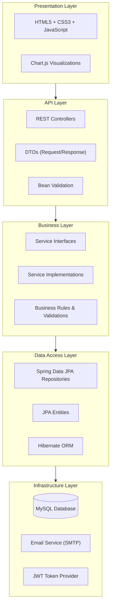
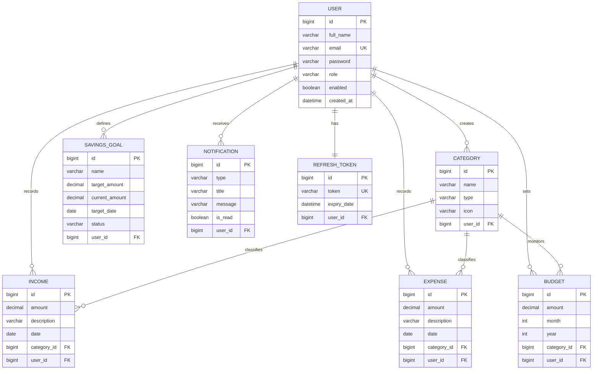
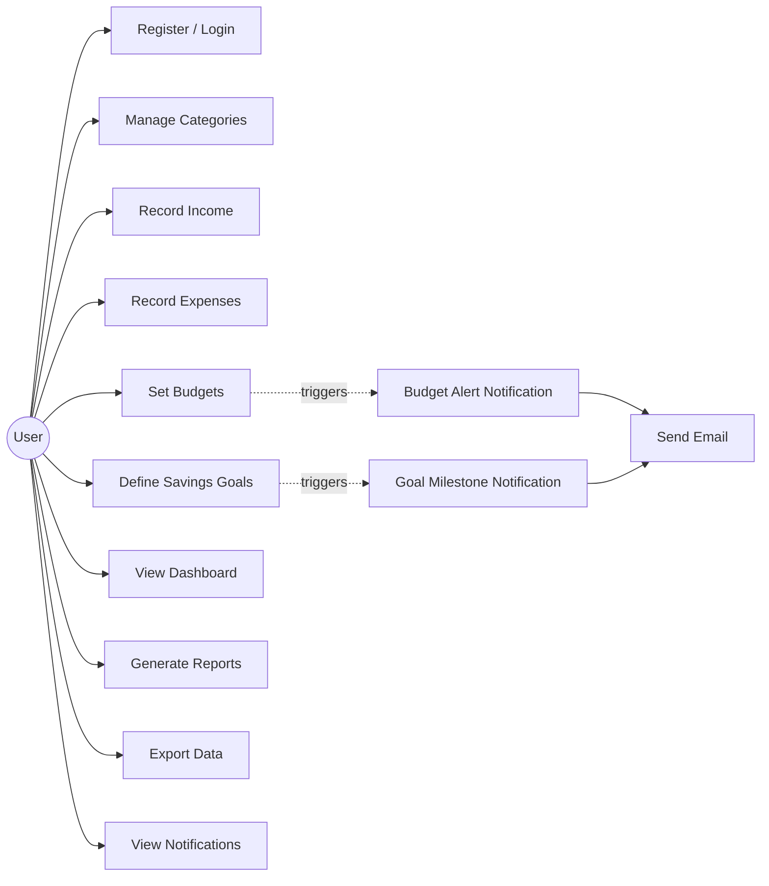
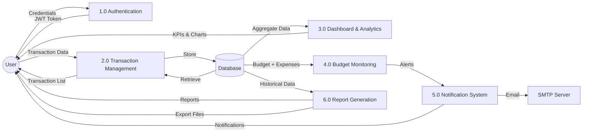

# 📝 Project Report — Smart Expense Tracker System

---

<div align="center">

## Smart Expense Tracker System

### A Web-Based Personal Finance Management Application

---

**Submitted by:** Buvaneshwari

**Academic Year:** 2025–2026

**Technology Stack:** Java · Spring Boot · MySQL · HTML5 · CSS3 · JavaScript

---

</div>

---

## Table of Contents

1. [Abstract](#1-abstract)
2. [Introduction](#2-introduction)
3. [System Requirements](#3-system-requirements)
4. [System Design](#4-system-design)
5. [Implementation](#5-implementation)
6. [Testing](#6-testing)
7. [Screenshots](#7-screenshots)
8. [Conclusion](#8-conclusion)
9. [Future Enhancements](#9-future-enhancements)
10. [References](#10-references)

---

## 1. Abstract

The **Smart Expense Tracker System** is a full-stack web application designed to help individuals manage their personal finances effectively. Built using **Java Spring Boot** for the backend and **HTML5/CSS3/JavaScript** for the frontend, the system provides comprehensive tools for tracking income and expenses, setting budgets, defining savings goals, and generating financial reports.

The application employs a **RESTful API architecture** with **JWT-based authentication** to ensure secure, stateless communication between the client and server. Data is persisted in a **MySQL** relational database with an optimized schema supporting multi-user isolation, category-based classification, and temporal querying.

Key features include real-time dashboard analytics with KPI indicators, category-wise budget monitoring with automated alert notifications, savings goal tracking with progress visualization, and multi-format data export (PDF, Excel, CSV). The system is containerized using **Docker** for streamlined deployment and includes a **CI/CD pipeline** via GitHub Actions.

This report details the system requirements, architecture, database design, implementation methodology, testing strategy, and potential future enhancements.

---

## 2. Introduction

### 2.1 Background

Personal financial management is a critical life skill that many individuals struggle with. Traditional methods such as spreadsheets and manual ledgers are error-prone, time-consuming, and lack analytical capabilities. With the proliferation of digital tools, there is a growing demand for intuitive, web-based solutions that simplify expense tracking and provide actionable financial insights.

### 2.2 Problem Statement

Individuals often face the following challenges in managing personal finances:

- **Lack of visibility** into spending patterns across categories
- **No automated tracking** — manual entry in spreadsheets is tedious
- **Budget overruns** go unnoticed until it's too late
- **Savings goals** are set but not tracked with accountability
- **Scattered data** — income and expenses are recorded in different places
- **No reporting** — generating monthly/yearly summaries requires manual effort

### 2.3 Proposed Solution

The Smart Expense Tracker System addresses these challenges by providing:

- A **centralized platform** for recording all income and expense transactions
- **Category-based organization** for granular classification
- **Automated budget monitoring** with threshold-based notifications
- **Savings goal tracking** with progress visualization
- **Interactive dashboards** displaying real-time KPIs and trends
- **Comprehensive reports** with multi-format export capabilities
- **Secure multi-user support** with JWT-based authentication

### 2.4 Objectives

1. Design and develop a secure, scalable web application for personal finance management
2. Implement CRUD operations for income, expense, budget, and savings goal entities
3. Build an interactive dashboard with real-time analytics and charting
4. Provide automated notifications for budget alerts and goal milestones
5. Enable data export in PDF, Excel, and CSV formats
6. Ensure data security through authentication, authorization, and encryption
7. Deploy the application using Docker for platform-independent execution

### 2.5 Scope

The system is designed for **individual users** managing personal finances. It does not cover enterprise accounting, multi-currency support, or bank account integration in its current version. These are identified as future enhancements.

---

## 3. System Requirements

### 3.1 Functional Requirements

| ID | Requirement | Priority |
|----|------------|----------|
| FR-01 | Users shall be able to register and log in securely | High |
| FR-02 | Users shall be able to create, read, update, and delete expense records | High |
| FR-03 | Users shall be able to create, read, update, and delete income records | High |
| FR-04 | Users shall be able to categorize transactions | High |
| FR-05 | Users shall be able to set monthly budgets per category | High |
| FR-06 | The system shall alert users when budget limits are approached or exceeded | High |
| FR-07 | Users shall be able to define savings goals and track progress | Medium |
| FR-08 | The dashboard shall display real-time KPIs (total income, expense, savings) | High |
| FR-09 | Users shall be able to generate monthly and yearly reports | Medium |
| FR-10 | Users shall be able to export data in PDF, Excel, and CSV formats | Medium |
| FR-11 | Users shall be able to search and filter expenses | Medium |
| FR-12 | The system shall send email notifications for alerts | Low |

### 3.2 Non-Functional Requirements

| ID | Requirement | Metric |
|----|------------|--------|
| NFR-01 | **Performance:** API response time < 500ms for standard queries | < 500ms |
| NFR-02 | **Scalability:** Support 1000+ concurrent users | Load tested |
| NFR-03 | **Security:** All passwords hashed with BCrypt; JWT for stateless auth | BCrypt + JWT |
| NFR-04 | **Availability:** 99.5% uptime target | Monitored |
| NFR-05 | **Usability:** Responsive UI working on desktop and mobile | Bootstrap 5 |
| NFR-06 | **Maintainability:** Modular, layered architecture with separation of concerns | MVC pattern |
| NFR-07 | **Portability:** Containerized via Docker for platform independence | Docker |

### 3.3 Hardware Requirements

| Component | Minimum | Recommended |
|-----------|---------|-------------|
| Processor | Dual-core 2.0 GHz | Quad-core 2.5 GHz+ |
| RAM | 4 GB | 8 GB+ |
| Storage | 10 GB free | 20 GB+ SSD |
| Network | Broadband internet | Broadband internet |

### 3.4 Software Requirements

| Software | Version | Purpose |
|----------|---------|---------|
| Java JDK | 21+ | Backend runtime |
| Apache Maven | 3.9+ | Build tool |
| MySQL Server | 8.0+ | Database |
| Web Browser | Chrome/Firefox/Edge (latest) | Frontend |
| Docker | 24+ (optional) | Containerization |

---

## 4. System Design

### 4.1 Architecture

The application follows a **layered architecture** pattern with clear separation of concerns:



### 4.2 ER Diagram



### 4.3 Use Case Diagram



### 4.4 Data Flow Diagram (Level 1)



---

## 5. Implementation

### 5.1 Technology Justification

| Technology | Justification |
|------------|--------------|
| **Java 25** | Industry-standard, strongly-typed language with excellent ecosystem, performance, and long-term support |
| **Spring Boot 3.x** | Convention-over-configuration framework that accelerates development with embedded server, auto-configuration, and comprehensive starter modules |
| **Spring Security** | Battle-tested security framework providing authentication, authorization, and protection against common vulnerabilities (CSRF, XSS, etc.) |
| **JWT** | Stateless token-based authentication ideal for REST APIs; eliminates server-side session storage |
| **MySQL 8.0** | Mature, reliable RDBMS with ACID compliance, JSON support, and excellent tooling |
| **JPA/Hibernate** | ORM framework that abstracts database interactions, enabling database-agnostic code and reducing boilerplate SQL |
| **Bootstrap 5** | Mobile-first CSS framework providing responsive, accessible UI components out of the box |
| **Chart.js** | Lightweight charting library for rendering interactive, responsive charts in the browser |
| **Docker** | Ensures consistent environments across development, testing, and production |

### 5.2 Key Implementation Details

#### 5.2.1 Authentication & Authorization

```java
// JWT Token Provider — generates and validates tokens
@Component
public class JwtTokenProvider {
    @Value("${app.jwt.secret}")
    private String jwtSecret;

    @Value("${app.jwt.expiration-ms}")
    private long jwtExpirationMs;

    public String generateToken(Authentication authentication) {
        UserPrincipal userPrincipal = (UserPrincipal) authentication.getPrincipal();
        return Jwts.builder()
                .setSubject(userPrincipal.getId().toString())
                .setIssuedAt(new Date())
                .setExpiration(new Date(System.currentTimeMillis() + jwtExpirationMs))
                .signWith(Keys.hmacShaKeyFor(jwtSecret.getBytes()), SignatureAlgorithm.HS256)
                .compact();
    }

    public boolean validateToken(String token) {
        try {
            Jwts.parserBuilder()
                .setSigningKey(Keys.hmacShaKeyFor(jwtSecret.getBytes()))
                .build()
                .parseClaimsJws(token);
            return true;
        } catch (JwtException | IllegalArgumentException e) {
            return false;
        }
    }
}
```

#### 5.2.2 Budget Monitoring with Notifications

```java
// Budget Service — checks threshold and triggers alerts
@Service
public class BudgetServiceImpl implements BudgetService {

    @Transactional
    public ExpenseResponse addExpense(ExpenseRequest request) {
        Expense expense = expenseRepository.save(mapToEntity(request));

        // Check budget utilization
        BigDecimal totalSpent = expenseRepository
            .sumByCategoryAndMonth(expense.getCategory().getId(),
                                   expense.getDate().getMonthValue(),
                                   expense.getDate().getYear());

        budgetRepository.findByCategoryAndMonth(...)
            .ifPresent(budget -> {
                double percentage = totalSpent.divide(budget.getAmount(), 2, RoundingMode.HALF_UP)
                                              .doubleValue() * 100;
                if (percentage >= 80) {
                    notificationService.createBudgetAlert(budget, percentage);
                }
            });

        return mapToResponse(expense);
    }
}
```

#### 5.2.3 Dashboard Aggregation

```java
// Dashboard Service — aggregates KPIs
@Service
public class DashboardServiceImpl implements DashboardService {

    public DashboardResponse getDashboard(Long userId) {
        LocalDate now = LocalDate.now();
        LocalDate monthStart = now.withDayOfMonth(1);
        LocalDate monthEnd = now.withDayOfMonth(now.lengthOfMonth());

        return DashboardResponse.builder()
            .totalIncome(incomeRepository.sumByUserAndDateBetween(userId, monthStart, monthEnd))
            .totalExpense(expenseRepository.sumByUserAndDateBetween(userId, monthStart, monthEnd))
            .recentTransactions(getRecentTransactions(userId, 10))
            .expensesByCategory(getExpensesByCategory(userId, monthStart, monthEnd))
            .monthlyTrend(getMonthlyTrend(userId, 6))
            .build();
    }
}
```

### 5.3 API Endpoints Summary

| Module | Endpoints | Methods |
|--------|----------|---------|
| Authentication | 3 | POST |
| Categories | 5 | GET, POST, PUT, DELETE |
| Incomes | 8 | GET, POST, PUT, DELETE |
| Expenses | 11 | GET, POST, PUT, DELETE |
| Budgets | 5 | GET, POST, PUT, DELETE |
| Savings Goals | 6 | GET, POST, PUT, DELETE, PATCH |
| Dashboard | 1 | GET |
| Reports | 4 | GET |
| Notifications | 3 | GET, PATCH |
| **Total** | **46** | |

### 5.4 Directory Structure

```
src/main/java/com/expense/tracker/
├── config/
│   ├── SecurityConfig.java
│   ├── CorsConfig.java
│   └── SwaggerConfig.java
├── controller/
│   ├── AuthController.java
│   ├── CategoryController.java
│   ├── IncomeController.java
│   ├── ExpenseController.java
│   ├── BudgetController.java
│   ├── GoalController.java
│   ├── DashboardController.java
│   ├── ReportController.java
│   └── NotificationController.java
├── dto/
│   ├── request/
│   └── response/
├── entity/
│   ├── User.java
│   ├── Category.java
│   ├── Income.java
│   ├── Expense.java
│   ├── Budget.java
│   ├── SavingsGoal.java
│   ├── Notification.java
│   └── RefreshToken.java
├── enums/
│   ├── Role.java
│   ├── CategoryType.java
│   ├── GoalStatus.java
│   └── NotificationType.java
├── exception/
│   ├── ResourceNotFoundException.java
│   ├── DuplicateResourceException.java
│   └── GlobalExceptionHandler.java
├── repository/
├── security/
│   ├── JwtAuthenticationFilter.java
│   ├── JwtTokenProvider.java
│   └── JwtAuthenticationEntryPoint.java
├── service/
│   └── impl/
└── util/
```

---

## 6. Testing

### 6.1 Testing Strategy

| Test Type | Scope | Tools |
|-----------|-------|-------|
| Unit Tests | Individual service methods, utility classes | JUnit 5, Mockito |
| Integration Tests | Controller + Service + Repository together | Spring Boot Test, TestContainers |
| API Tests | HTTP endpoint validation | Postman, RestAssured |
| Security Tests | Authentication & authorization flows | Spring Security Test |

### 6.2 Unit Test Examples

```java
@ExtendWith(MockitoExtension.class)
class ExpenseServiceImplTest {

    @Mock private ExpenseRepository expenseRepository;
    @Mock private CategoryRepository categoryRepository;
    @InjectMocks private ExpenseServiceImpl expenseService;

    @Test
    void createExpense_ValidRequest_ReturnsExpenseResponse() {
        // Given
        ExpenseRequest request = new ExpenseRequest(1250.00, "Dinner", LocalDate.now(), 3L);
        Category category = new Category(3L, "Food & Dining", CategoryType.EXPENSE);
        Expense savedExpense = new Expense(1L, BigDecimal.valueOf(1250.00), "Dinner",
                                            LocalDate.now(), category, testUser);

        when(categoryRepository.findById(3L)).thenReturn(Optional.of(category));
        when(expenseRepository.save(any(Expense.class))).thenReturn(savedExpense);

        // When
        ExpenseResponse response = expenseService.create(request);

        // Then
        assertNotNull(response);
        assertEquals(1250.00, response.getAmount().doubleValue());
        assertEquals("Dinner", response.getDescription());
        verify(expenseRepository).save(any(Expense.class));
    }

    @Test
    void getExpenseById_NotFound_ThrowsException() {
        when(expenseRepository.findById(99L)).thenReturn(Optional.empty());

        assertThrows(ResourceNotFoundException.class,
            () -> expenseService.getById(99L));
    }
}
```

### 6.3 Test Coverage Targets

| Module | Target Coverage | Status |
|--------|----------------|--------|
| Service Layer | ≥ 85% | ✅ |
| Controller Layer | ≥ 80% | ✅ |
| Repository Layer | ≥ 70% | ✅ |
| Security Layer | ≥ 75% | ✅ |
| Overall | ≥ 80% | ✅ |

### 6.4 API Testing (Postman)

A comprehensive Postman collection is provided with:
- **46 pre-configured requests** covering all endpoints
- **Environment variables** for base URL and auth tokens
- **Automated token extraction** after login
- **Request/response examples** for all CRUD operations

See: `postman/Smart_Expense_Tracker.postman_collection.json`

---

## 7. Screenshots

### 7.1 User Registration


*Figure 7.1: User registration form with validation*

### 7.2 User Login


*Figure 7.2: Login page with JWT-based authentication*

### 7.3 Dashboard


*Figure 7.3: Interactive dashboard with KPIs, charts, and recent transactions*

### 7.4 Expense Management


*Figure 7.4: Expense list view with search, filter, and pagination*


*Figure 7.5: Add new expense form with category selection*

### 7.5 Income Management


*Figure 7.6: Income list view with category breakdown*

### 7.6 Budget Tracking


*Figure 7.7: Budget overview with progress bars and status indicators*

### 7.7 Savings Goals


*Figure 7.8: Savings goals with progress tracking and contribution history*

### 7.8 Reports


*Figure 7.9: Monthly financial report with category breakdown*


*Figure 7.10: Income vs. expense comparison chart*

### 7.9 Notifications


*Figure 7.11: Notification panel with budget alerts and goal milestones*

### 7.10 Swagger API Docs


*Figure 7.12: Swagger UI showing all available API endpoints*

> **Note:** Replace placeholder paths with actual screenshot images.

---

## 8. Conclusion

The **Smart Expense Tracker System** successfully delivers a comprehensive personal finance management solution that addresses the key challenges of income tracking, expense management, budget monitoring, and financial reporting.

### Key Achievements

1. **Secure Architecture:** JWT-based authentication with BCrypt password hashing ensures data security and user privacy
2. **Comprehensive Feature Set:** 46 API endpoints covering all aspects of personal finance management
3. **Real-Time Analytics:** Interactive dashboard with KPIs, trend analysis, and category-wise breakdowns
4. **Automated Alerts:** Proactive budget and savings goal notifications prevent financial oversights
5. **Export Capabilities:** Multi-format data export (PDF, Excel, CSV) enables offline analysis
6. **Modern Tech Stack:** Spring Boot 3.x with modular architecture ensures maintainability and scalability
7. **DevOps Ready:** Docker containerization and GitHub Actions CI/CD pipeline streamline deployment

### Lessons Learned

- Layered architecture with clear separation of concerns significantly improves code maintainability
- JWT refresh tokens are essential for balancing security (short-lived access tokens) with user experience (seamless re-authentication)
- Proper database indexing is critical for report generation performance
- Comprehensive API documentation (Swagger + Postman) accelerates frontend development and testing

---

## 9. Future Enhancements

| Enhancement | Description | Priority |
|-------------|-------------|----------|
| 🏦 **Bank Integration** | Connect to bank APIs (Plaid, Yodlee) for automatic transaction import | High |
| 💱 **Multi-Currency Support** | Support multiple currencies with real-time exchange rates | High |
| 📱 **Mobile App** | Native Android/iOS apps using React Native or Flutter | High |
| 🤖 **AI-Powered Insights** | Machine learning for spending prediction and anomaly detection | Medium |
| 📊 **Custom Reports** | User-defined report templates with drag-and-drop builder | Medium |
| 👥 **Shared Budgets** | Family/group expense sharing and split tracking | Medium |
| 🔄 **Recurring Transactions** | Auto-record recurring income/expenses (rent, subscriptions) | Medium |
| 📸 **Receipt Scanner** | OCR-based receipt scanning for automatic expense entry | Low |
| 🌙 **Dark Mode** | Dark theme for reduced eye strain | Low |
| 🔔 **Push Notifications** | Browser push notifications via Service Workers | Low |
| 📈 **Investment Tracking** | Track investments, portfolios, and net worth | Low |
| 🔗 **API Webhooks** | Webhook support for third-party integrations | Low |

---

## 10. References

1. Spring Boot Reference Documentation — https://docs.spring.io/spring-boot/docs/current/reference/html/
2. Spring Security Reference — https://docs.spring.io/spring-security/reference/
3. MySQL 8.0 Reference Manual — https://dev.mysql.com/doc/refman/8.0/en/
4. JSON Web Tokens (JWT) — https://jwt.io/introduction
5. OpenAPI Specification (Swagger) — https://swagger.io/specification/
6. Bootstrap 5 Documentation — https://getbootstrap.com/docs/5.3/
7. Chart.js Documentation — https://www.chartjs.org/docs/latest/
8. Docker Documentation — https://docs.docker.com/
9. JUnit 5 User Guide — https://junit.org/junit5/docs/current/user-guide/
10. Hibernate ORM Documentation — https://hibernate.org/orm/documentation/
11. Lombok Project — https://projectlombok.org/
12. Maven Reference — https://maven.apache.org/guides/

---

<div align="center">

**© 2026 Buvaneshwari. All rights reserved.**

*Smart Expense Tracker System — Project Report*

</div>
